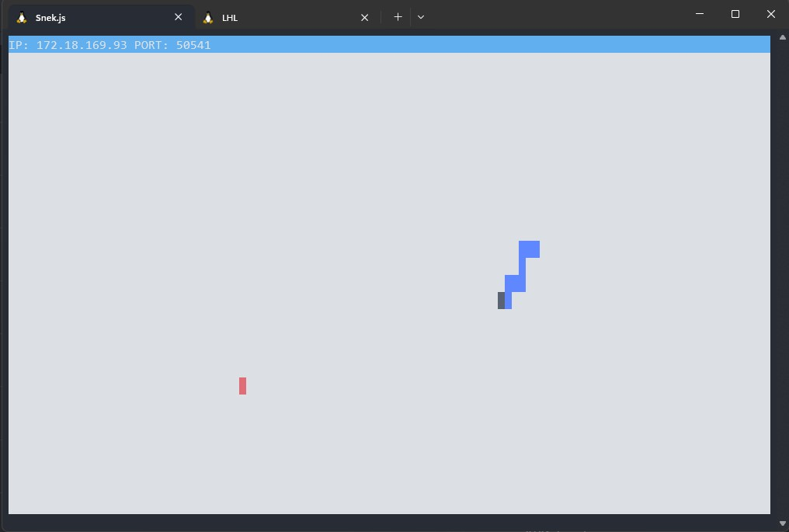

# Snake Game Readme

## Introduction
This repository contains the client-side code for a simple Snake game built using Node.js. The game utilizes TCP/IP networking for communication and allows players to control a snake within a designated game area. This client-side code works in conjunction with the server-side code provided in the [Snek Multiplayer](https://github.com/lighthouse-labs/snek-multiplayer) repository.

## Prerequisites
Before running the Snake game client, ensure that you have completed the following steps:

1. Follow the instructions in the [Snek Multiplayer](https://github.com/lighthouse-labs/snek-multiplayer) repository to set up and run the server-side code for the Snake game.

## Getting Started
To run the Snake game client, follow these steps:

1. Clone this repository to your local machine:
```git clone <repository_url>```

2. Navigate to the project directory:
```cd snake-game```

3. Install the necessary dependencies:
```npm install```

4. Start the Snake game client:
```node play.js```


5. Control the snake using the following keys:
- W: Move up
- S: Move down
- A: Move left
- D: Move right
- M: Send a message to the game server

6. Have fun playing the Snake game!

## File Structure
The repository consists of the following files:

- `client.js`: This file establishes a connection with the game server and handles incoming data from the server.

- `input.js`: This file handles user input from stdin and sends corresponding commands to the game server.

- `play.js`: This is the main entry point of the game. It imports the necessary modules and sets up the game by starting the server and handling user input.

- `constants.js`: This file contains constants such as the IP address, port number, and user name used in the game.

## Dependencies
The Snake game client has the following dependencies:
- `net`: Used for creating TCP/IP connections.
- `console`: Used for logging messages to the console.

## Final Product




